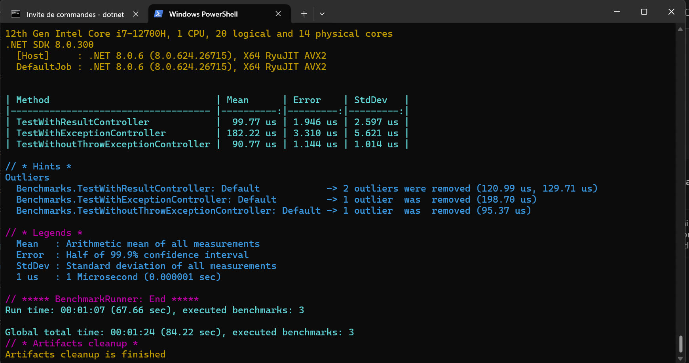

# Graceful Error Handling with Result Monad in C#

Error handling is an inevitable part of software development. Traditionally, exceptions are the primary method for signaling that something has gone awry. However, the exception mechanism is fraught with issues: unpredictable control flow, performance bottlenecks, and challenges in debugging. Imagine a world where error handling is graceful, predictable, and efficient. Enter the Result Monad—a powerful alternative to exceptions that can streamline error handling, improve code maintainability, and make your programs more robust.

## The Problem with Exceptions

Exceptions might seem like a convenient error-handling mechanism, but they introduce several issues:

- **Disrupted Control Flow:** Exceptions cause jumps in control flow, making it difficult to manage and predict.
- **Performance Bottlenecks:** The overhead involved in generating and throwing exceptions can be significant.
- **Debugging Challenges:** Their implicit behavior complicates reasoning about where an exception can come from and what it can contain.

## Understanding Result Monad

The Result Monad originates from functional programming and provides a structured way to handle computations that might fail. At its core, the Result Monad encapsulates a value that can either be a success or a failure, without throwing exceptions. This makes error handling explicit and predictable, enhancing code readability and maintainability. Typical use cases include API responses, file I/O operations, and database transactions. Essentially, any operation that can either succeed or fail can benefit from using a Result Monad.

### Launch the web API

### Launch the benchmark

## Conclusion

By moving from exceptions to the Result Monad, developers can achieve better code readability, improved performance, and more predictable error handling. The Result Monad reduces the cognitive load required to understand and manage failure states, making for cleaner, more robust code. So next time you're faced with the choice, consider opting for the Result Monad and experience the benefits firsthand.